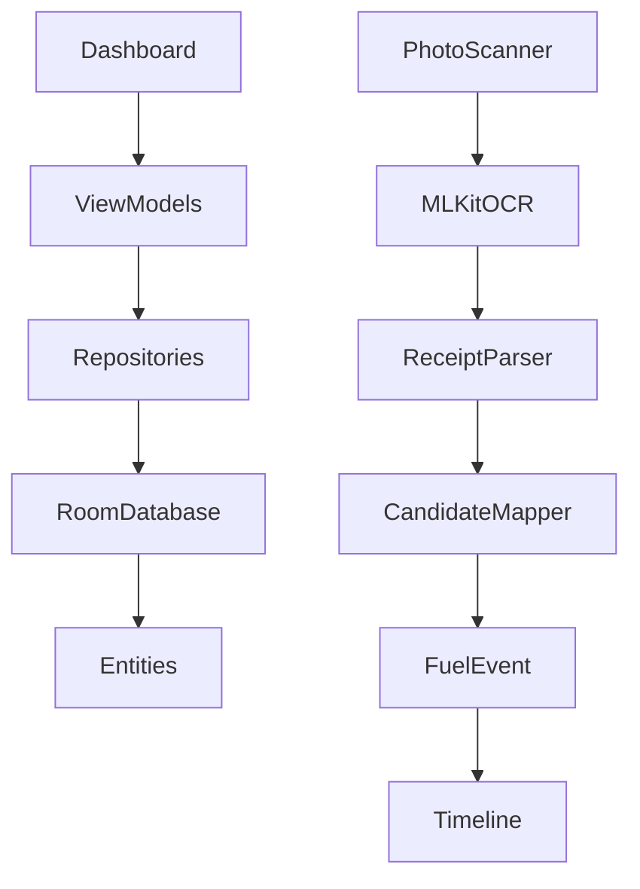

# Architecture Overview

```mermaid
graph TD;
    Dashboard --> ViewModels;
    ViewModels --> Repositories;
    Repositories --> RoomDatabase;
    RoomDatabase --> Entities;
    
    PhotoScanner --> MLKitOCR;
    MLKitOCR --> ReceiptParser;
    ReceiptParser --> CandidateMapper;
    CandidateMapper --> FuelEvent;
    FuelEvent --> Timeline;
```

This diagram shows the high‑level structure of the app, from UI components down to the Room database and the processing pipeline for photo scanning and receipt parsing.
